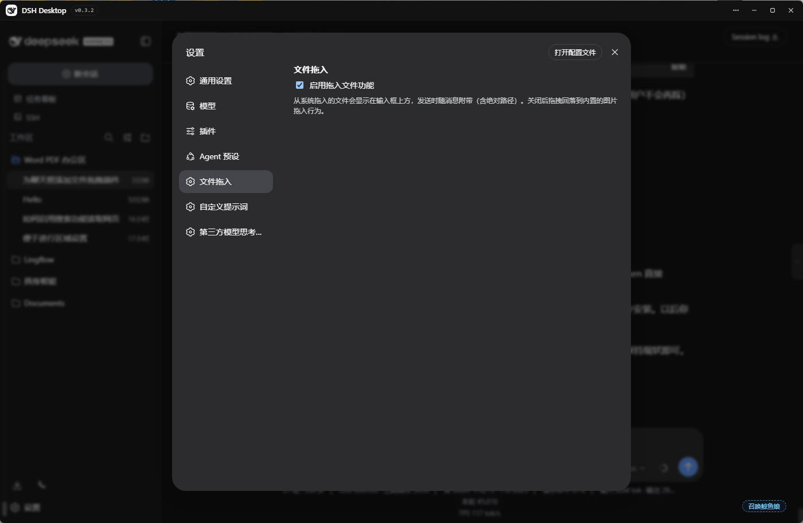

# dsh-drop-in

> 🌐 English: [README.md](README.md)

把系统文件管理器里的文件直接拖进 DeepSeek Harness Web 界面。文件会显示在输入框上方的
文件栏里，发送消息时随消息一起发出（含**绝对路径**），并在气泡中渲染成漂亮的文件卡片。
助手读取的是真实路径——不上传、不复制内容。




## 特性

- 🖱️ 拖入**任意文件/文件夹**（图片也按文件处理——官方"拖图片"遮罩不再抢占拖拽）
- 📌 输入框上方文件栏：图标 + 名称 + 大小 + 路径状态，可单独移除（×），自动去重
  （同路径 / 名称+大小+修改时间 相同不重复添加）
- ✉️ 发送消息时自动附带 `📎 拖入文件` 块（名称、大小、**绝对路径**），气泡渲染为
  文件卡片，悬停可看完整路径
- 🔧 提供 `dropped_files` 工具，助手可随时读取尚未发送的拖入文件
- 🖥️ DSH Desktop（Electron）下绝对路径来自 preload 小桥
  （`webUtils.getPathForFile`，新版 Electron 唯一取路径方式）
- 🌐 兜底：普通浏览器（无 preload 桥）下，小文本文件会复制到工作区 `.dsh-drops/`，
  助手仍可读取

## 安装

```sh
dsh plugin --profile web add https://github.com/<you>/dsh-drop-in/archive/refs/tags/v1.1.0.tar.gz
```

或手动安装（bundle 形态）：

1. 解压 `dsh-drop-in` 到 `~/.dsh/profiles/web/node_modules/dsh-drop-in/`
2. 在 `~/.dsh/profiles/web/package.json` 的 `dsh.profile.bundles` 数组加入
   `"dsh-drop-in"`
3. 重启 `dsh web`（DSH Desktop：完全退出再打开，或在 DevTools 控制台执行
   `window.dshDesktop.restartService()`）

## 使用

1. 从资源管理器把文件拖进聊天页
2. 输入框上方出现文件栏，显示将要附带的内容
3. 输入消息并发送（回车或发送按钮）
4. 消息气泡中显示文件卡片——助手在消息里直接拿到绝对路径，可用自己的工具读取文件

## 工作原理

- 客户端半在捕获阶段拦截文件拖拽（官方图片上传流程不会抢走事件），维护按会话隔离的
  文件栏（`conversation.input.dock`），用文件卡片渲染用户消息气泡
  （`conversation.chat.node` 的 `user` key），并在提交前把 `📎 拖入文件` 块拼进
  draft（回车和发送按钮两条路径都覆盖）
- 宿主半维护按会话的文件登记表，通过 `dropped_files` 工具提供给助手；（浏览器兜底时）
  把文本文件写入 `.dsh-drops/<sessionId>/`
- DSH Desktop 下绝对路径依赖 preload 桥（见 [preload-bridge.md](preload-bridge.md)）：
  Electron ≥ 32 已移除 `File.path`，这是唯一能拿到真实路径的方式

## 配置

| 设置项 | 说明 |
| --- | --- |
| `enabled` | 总开关（设置 → 文件拖入）。关闭后拖拽行为回落到内置逻辑。 |

## 卸载

1. 从 `~/.dsh/profiles/web/package.json` 的 `dsh.profile.bundles` 移除 `dsh-drop-in`
2. 删除 `~/.dsh/profiles/web/node_modules/dsh-drop-in/`
3. 重启 `dsh web`

## 许可证

MIT
